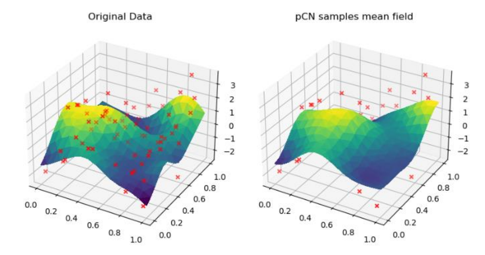
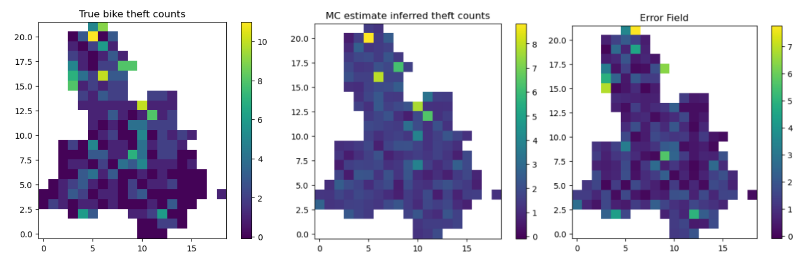

# Bayesian Inference for Simulated and Real-World Spatial Data

## Overview
Gaussian random walk Metropolis Hastings (GRW-MH) and the preconditioned Crank-Nicolson (pCN) method) are compared, when sampling latent variables on a 2D
domain (part I).

Also built a Bayesian spatial Poisson regression model to predict bike theft intensity across Lewisham, London, achieving a low mean prediction error of 1.12 predicted bike thefts at the optimal kernel length-scale (part II).

## Code Structure
Code supplied in functions.py contains useful functions for generating matrices, plotting, and skeleton code to be completed.   

The file ``data.csv`` is the bike theft data used in part II.

The files `simulation.py` and `spatial.py` contain the code to set up the problem and relevant plotting examples. ``functions.py`` contains core functions used in part I and part II.   

The `partI.ipynb` and `partII.ipynb` contains main process for this project.  
